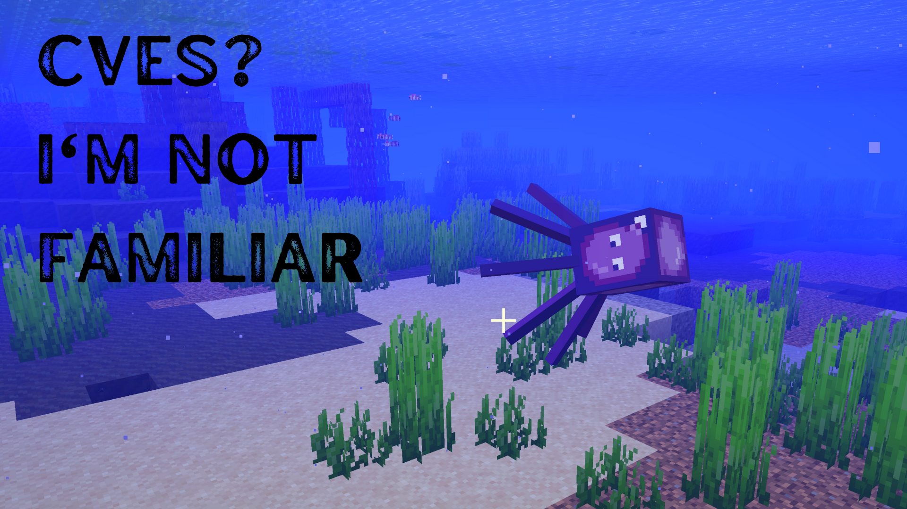
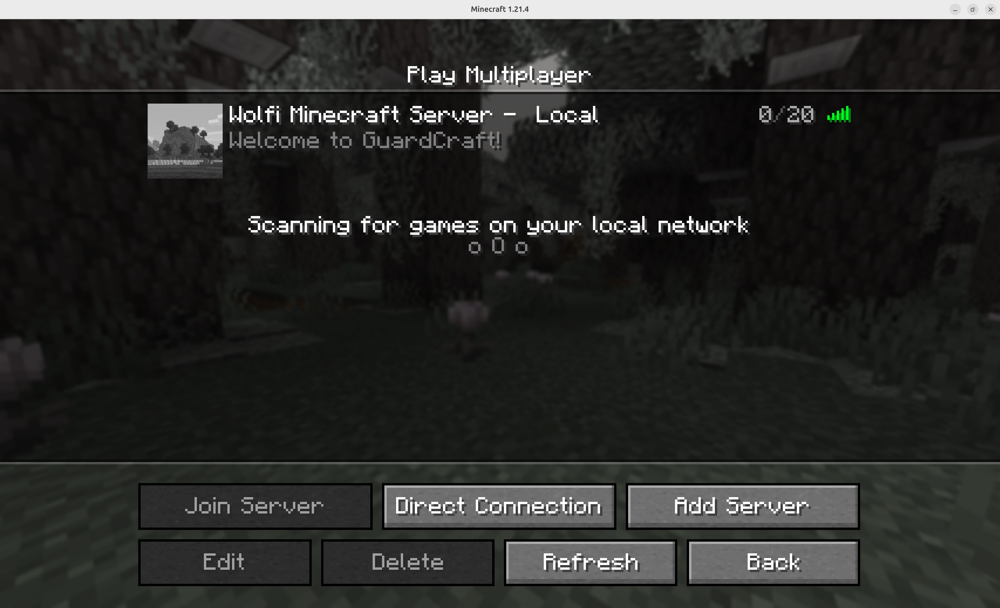
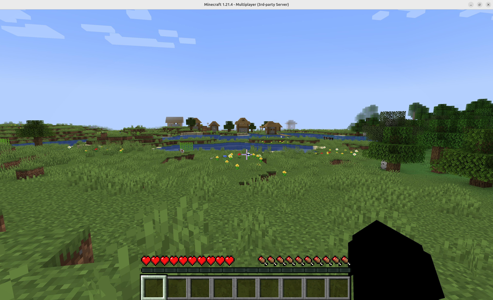
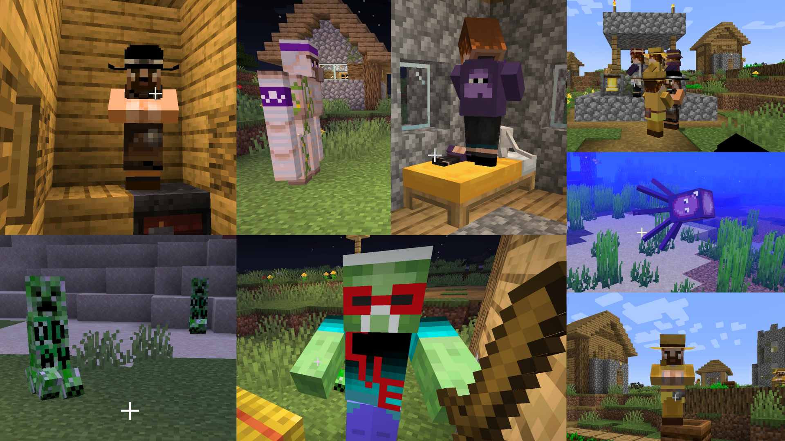
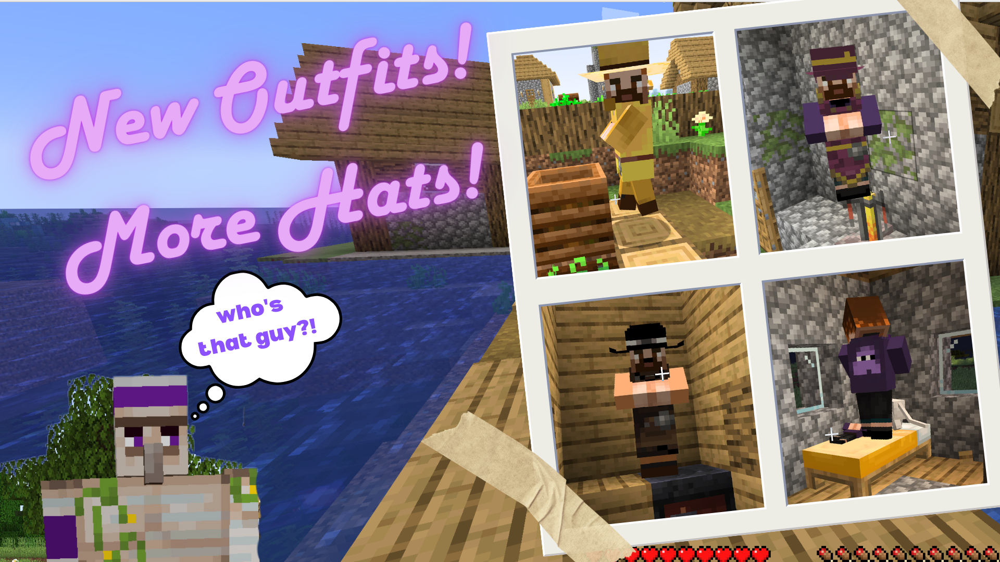

# GuardCraft - a Containerized Minecraft Server

GuardCraft is a containerized Minecraft (Java) server that is designed to be secure and easy to use. It is built on top of the [Java JRE Chainguard Image](https://images.chainguard.dev/directory/image/jre/versions). 



## Features
The GuardCraft server is designed to be secure and easy to use. It includes the following features:
- Minimal container image with low-to-zero CVEs
- Easy configuration with environment variables
- Easy setup with Docker Compose

Currently, Guardcraft is available only for Minecraft Java version.

*This setup was validated on an Ubuntu 24.04 system.*

## Usage
To build the image, run:

```shell
docker build -t guardcraft-java .
```

Use the following command to run the image in your local environment:

```shell
docker compose up
```
You should be able to see output with relevant information about the server setup:

```shell
[+] Running 1/1
 ✔ Container guardcraft-server-java-server-1  Recreated                                                             0.1s 
Attaching to java-server-1
java-server-1  | Setting difficulty=easy
java-server-1  | Setting gamemode=survival
java-server-1  | Setting level-name=GuardCraft
java-server-1  | Setting level-seed=-1718501946501227358
java-server-1  | Setting motd=Welcome to GuardCraft!
java-server-1  | Starting net.minecraft.server.Main
java-server-1  | [18:11:14] [ServerMain/INFO]: Environment: Environment[sessionHost=https://sessionserver.mojang.com, servicesHost=https://api.minecraftservices.com, name=PROD]
java-server-1  | [18:11:14] [ServerMain/INFO]: No existing world data, creating new world
java-server-1  | [18:11:15] [ServerMain/INFO]: Loaded 1370 recipes
java-server-1  | [18:11:15] [ServerMain/INFO]: Loaded 1481 advancements
java-server-1  | [18:11:15] [Server thread/INFO]: Starting minecraft server version 1.21.4
java-server-1  | [18:11:15] [Server thread/INFO]: Loading properties
java-server-1  | [18:11:15] [Server thread/INFO]: Default game type: SURVIVAL
java-server-1  | [18:11:15] [Server thread/INFO]: Generating keypair
java-server-1  | [18:11:15] [Server thread/INFO]: Starting Minecraft server on *:25565
...
```

Once the server is up and running, you can connect to it using a Minecraft Java client **on the same local network**.

To connect to the server, you'll need to add a new server using the host machine's local IP address and port `25565` (the default port). You can also use the `localhost` address if you're running the server on the same machine as the client.

> Find your local IP address on Linux systems: `ip -o route get to 8.8.8.8 | sed -n 's/.*src \([0-9.]\+\).*/\1/p'`


When connecting, you should see details about your user on the server logs:

```shell
java-server-1  | [18:12:21] [Server thread/INFO]: Server empty for 60 seconds, pausing
java-server-1  | [18:14:29] [User Authenticator #1/INFO]: UUID of player boredcatmom is xxxxx-xxxx-xxxx-xxxx-xxxxxxxx
java-server-1  | [18:14:30] [Server thread/INFO]: boredcatmom[/192.168.178.167:37192] logged in with entity id 78 at (20.5, 66.0, 4.5)
java-server-1  | [18:14:30] [Server thread/INFO]: boredcatmom joined the game

````

## Configuration
The GuardCraft server can be configured using dynamic environment variables that get replaced in the `server.properties` file. Any properties can be configured with the following format: `MC_<property_name>`. Hyphens (`-`) should be replaced with underscores (`_`). For example, to set the `server-port` property, use the `MC_server_port` environment variable. The [Minecraft wiki](https://minecraft.fandom.com/wiki/Server.properties) has a list of all available properties.

Included `docker-compose.yaml` file:

```yaml
services:
  java-server:
    image: guardcraft-java
    restart: unless-stopped
    ports:
      - 25565:25565
    environment:
      # Server properties Set Up
      # MC_* variables will be replaced in the server.properties file
      # Hyphens must be replaced with underscores
      MC_gamemode: "survival"
      MC_difficulty: "easy"
      MC_motd: "Welcome to GuardCraft!"
      MC_level_name: "GuardCraft"
      MC_level_seed: "-1718501946501227358"
      # GuardCraft Custom Resource pack: Optional. Uncomment from here to enable
      #MC_resource_pack: "https://github.com/chainguard-dev/guardcraft-server/releases/download/0.1.2/GuardCraft.zip"
      #MC_resource_pack_sha1: "ec784f4156bf0057967620020c9c1010eed2276f"
      #MC_resource_pack_id: "be26d8a0-6f82-4dcd-b286-6c5fc3a1e51f"
      #MC_require_resource_pack: "false"
```

This will set up a server in **Survival** mode, with **Easy** difficulty, and a **Welcome to GuardCraft!** message of the day. The server will be named **GuardCraft** and will use the specified seed to generate the world. You should spawn in an area with a village nearby.



## GuardCraft Resource Pack
The included Resource Pack brings fun to another level with some custom textures. Have a taste of fighting CVEs (Zombies) and 0Days (Creepers) to protect your friendly villagers! Or go for a swim and find Linky swirling in the oceans.



- Current Version: 0.1.2
- Direct Download link: https://github.com/chainguard-dev/guardcraft-server/releases/download/0.1.2/GuardCraft.zip
- SHA1 Checksum: ec784f4156bf0057967620020c9c1010eed2276f


### Automatic Installation
You can enable the GuardCraft texture pack by uncommenting the last 4 lines in the `docker-compose.yaml` file, as shown:

```yaml
      # GuardCraft Custom Resource pack: Optional. Uncomment from here to enable
      MC_resource_pack: "https://github.com/chainguard-dev/guardcraft-server/releases/download/0.1.2/GuardCraft.zip"
      MC_resource_pack_sha1: "ec784f4156bf0057967620020c9c1010eed2276f"
      MC_resource_pack_id: "be26d8a0-6f82-4dcd-b286-6c5fc3a1e51f"
      MC_require_resource_pack: "false"
```
Clients will automatically download the resource pack from the specified URL and verify the SHA1 checksum before enabling it.

### Manual Installation
You can also manually install it on any Java Minecraft world. Download it directly from the [GuardCraft Resource Pack Releases page](https://github.com/chainguard-dev/guardcraft-server/releases) and place the zip file in your resource packs folder, in your local Minecraft installation (no need to unpack it). On Linux systems, the location should be the `~/.minecraft/resourcepacks` directory. On macOS, you can find the resource packs folder in `~/Library/Application Support/minecraft/resourcepacks`. On Windows, the folder is located at `%appdata%\.minecraft\resourcepacks`.

You'll then be able to modify your world's settings to enable the resource pack by accessing the "Options" menu, then "Resource Packs". You can then select the GuardCraft Resource Pack and move it to the "Selected Resource Packs" list on the right. Make sure it sits on top of the list so it has precedence over other resource packs.




### GuardCraft Skins
The [skins](./skins) folder contains some custom player skins you can use to customize your character.